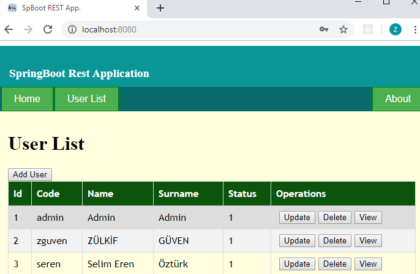

# Spring Boot, Hibernate JPA, REST CRUD, PostgreSQL Example
In this application, Spring Boot, Hibernate, JPA and REST techniques are used by connecting PostgreSQL database.


## Used Technologies
* Java 1.8
* Eclipse 4.6+ or Spring Tool Suite(STS)
* Spring Boot 2.1.7
* Hibernate 5.3.10
* JavaScript, Single Page Application


## Clone the Example
```bash
$ git clone https://github.com/zguven/SpringBoot_REST_JPA_PostgreSQL_JS.git
```


## Configure PostgreSQL Database

Build a new PostgreSQL database named "resttest" and User table by executing the following script.

```bash
$ CREATE DATABASE resttest
    WITH 
    OWNER = postgres
    ENCODING = 'UTF8'
    TABLESPACE = pg_default
    CONNECTION LIMIT = -1;

$ Create Table public.User (
 Id  bigserial NOT NULL,
 Code VARCHAR(30) NOT NULL,
 Name VARCHAR(30) NOT NULL,
 Surname VARCHAR(30) NOT NULL,
 Password VARCHAR(100) NOT NULL,
 Phone VARCHAR(20),
 Status Int2 NOT NULL,
 primary key(Id)
);

$ Alter table public.User
 add constraint UIdx_User_Code unique(Code);
 
$ ALTER SEQUENCE public.user_id_seq
    OWNER TO postgres;

```


### Insert a User row example(optional):
```
$ Insert into public.User(Code, Name, Surname, Password, Phone, Status)
Values('admin', 'Admin', 'Admin', '1111', null, 1);
```

### Configure Application Properties

Update "src/main/resources/application.properties" file according to your PostgreSQL connection.

```
spring.datasource.url=jdbc:postgresql://localhost:5432/resttest
spring.datasource.username=postgres
spring.datasource.password=postgres
```


## Package and test the application
You can package the application as JAR file and then run it like this:

```
$ mvnw clean package
```


## Run the application
Type the following command from the root directory of the project:

```
$ mvnw spring-boot:run
or
$ java -jar target/SpringBootRestJPAUserCRUD-0.0.1.jar
```


## Test the application on browser
After starting the application, type this url on a browser: [localhost:8080](http://localhost:8080/)



